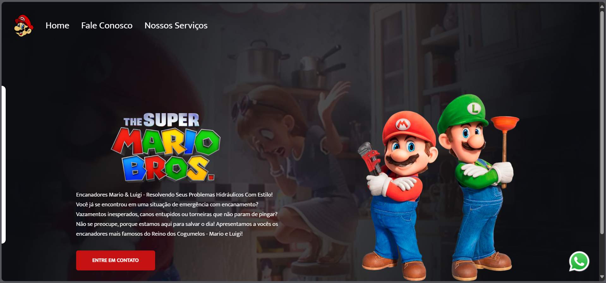

<h1>"Mário Project" (projectmb)</h1>
 
<h4>Work aimed at practicing acquired skills,
following the teachings of <a href="https://rodolfomori.com.br/devclub/" target="_blank">DevClub</a>
being employed: HTML, CSS, JavaScript and also taking care of responsiveness.</h4>
 
Link to see it: <a href="https://projectmb.netlify.app/">Mário Project</a>
 
 
 

    
    
